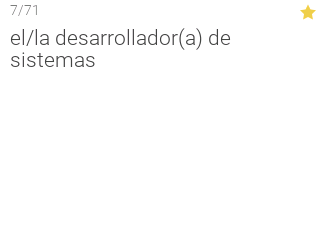

# n-flashcards

## Screenshots




## Usage

To use n-flashcards, save a file on your computer that has the extension `.csv.tns`.
Then, transfer it to your calculator and open it with `n-flashcards`, which you
may download from [the releases page][releases]. The `.csv` file should have the first
side first, then a comma, and then the second side. A third column containing `starred`,
`1`, or `true` indicates that the card is starred. Each line should be separated by a newline.
Proper escaping is recognized, using double quotes. See the following for Quizlet export
options:


See the included `example.csv.tns` for an example file.

[releases]: https://github.com/lights0123/n-flashcards/releases

## Prerequisites for development
- Ndless toolchain installed and added to path
- Rustup installed
- Latest Rust Nightly installed (nightly-2019-06-01 works)
- `jq`
- Unix-like (tested on Linux, most likely Mac and Cygwin will work as well)

Complete install script:
```bash
curl https://sh.rustup.rs -sSf | sh # skip if rustup already installed
rustup install nightly # skip if nightly already installed
cargo install cargo-make
```

Get started by running

```bash
cargo +nightly make dev
```

to start development. Your .tns file will be available in
`target/armv5te-nspire-eabi/debug/n-flashcards.tns`.

When you're ready to release your application,
**don't forget to compile in release mode** with

```bash
cargo +nightly make release
```

Your .tns file will be available in
`target/armv5te-nspire-eabi/release/n-flashcards.tns`

You may skip `+nightly` if you set nightly as your default compiler
(`rustup default nightly`), or
[set a directory override](https://github.com/rust-lang/rustup.rs#directory-overrides).

Check out the [ndless examples](https://github.com/lights0123/example-nspire)
for more info.
